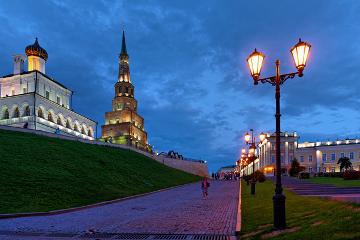
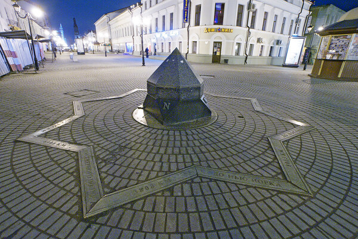
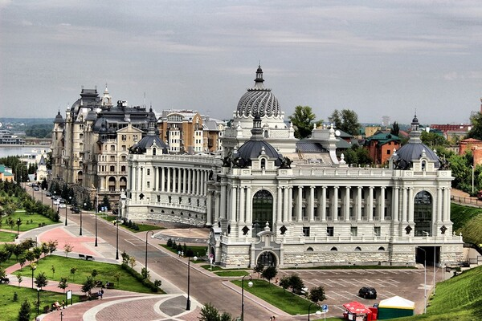
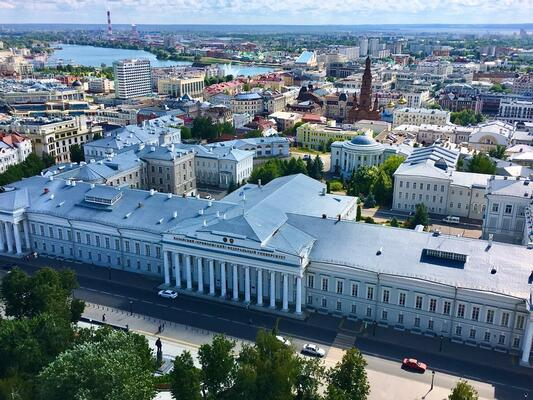
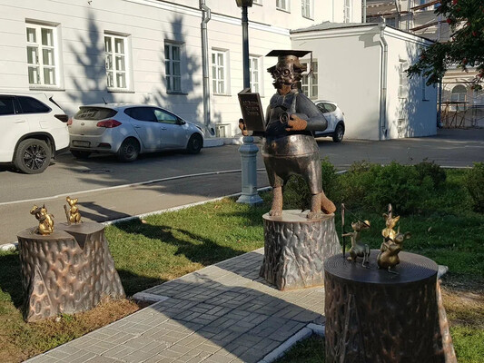

# Conference Venue

Kazan, the capital of Tatarstan, is a vibrant and multicultural city that
seamlessly blends Russian and Tatar heritage. 

Located at the confluence of the
Volga and Kazanka rivers, Kazan boasts a rich history, stunning architecture,
and a unique cultural landscape. As you explore the city during your conference
visit, you'll discover a fascinating mix of Islamic and Orthodox influences,
reflected in its historic landmarks, museums, and traditional cuisine. 

Summer is
a wonderful time to experience Kazan, with warm sunny days and mild evenings,
making it ideal for strolling along the picturesque riverbanks, visiting
historic sites, or simply enjoying the city's lively atmosphere. With average
high temperatures ranging from 22°C to 25°C, June is
a perfect month to explore all that Kazan has to offer, from its stunning Kremlin
to its vibrant cultural events and festivals.

Kazan Federal University (KFU) is one of Russia's oldest and most prestigious
institutions of higher education, and we are proud to have it as the organizer
of our conference. Founded in 1804, KFU has a long history of academic
excellence and innovation, with a strong focus on research and international
collaboration. The university's main building (depicted below) is located in the
centre of the Kazan, and the conference venue is a building nearby.

One of the charming landmarks on the campus of Kazan Federal University is the statue of the Learned Cat, a folklore figure in Russian culture. Originally an animal that could speak and tell stories, it was described in a poem by the Russian poet Pushkin. As one of the symbols of Kazan is Kazan cat, the statue of the Learned Cat was opened on the occasion of the KFU's birthday.

